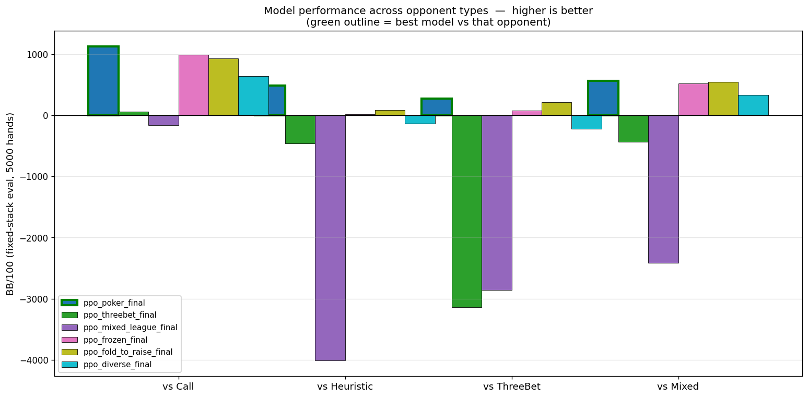
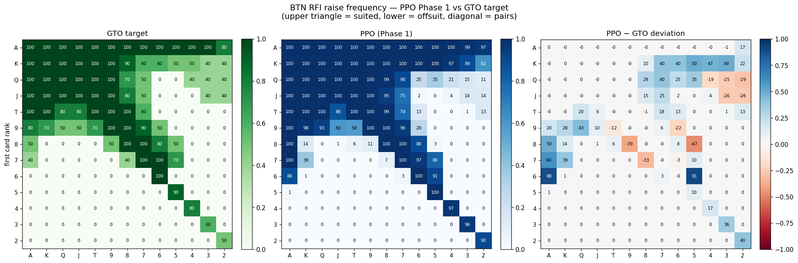
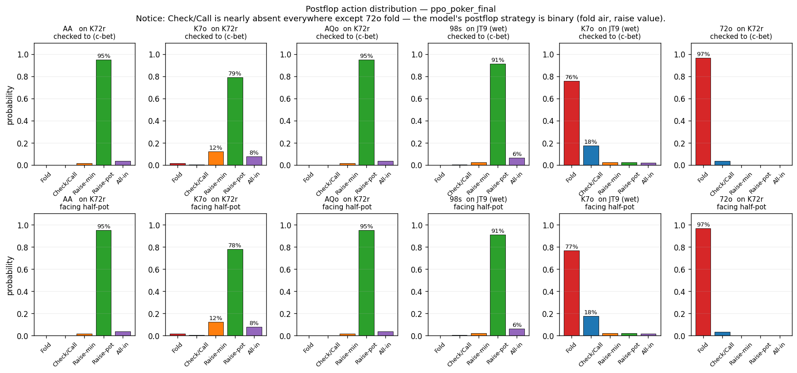

# rl-pokerlab

6-player No-Limit Texas Hold'em cash game for training and benchmarking RL agents.
Gymnasium-compatible interface, 5-discrete-action space, auto-rebuys at the
table, fixed-stack evaluation mode for noise-free measurement.

I built this as an end-to-end experiment: supervised GTO pretraining → PPO
fine-tuning → evaluation methodology fix → multiple fine-tuning attempts →
postflop diagnostic.  The shipping model is **`models/ppo_poker_final.zip`**
(referred to as "Phase 1" below).

---

## Setup

```bash
uv add gymnasium numpy pytest
uv add stable-baselines3 torch tensorboard
```

## Quickstart

```bash
# Train the shipping model from scratch
python pretrain_preflop.py                                # → models/ppo_pretrained.zip
python train_ppo.py --mode heuristic --timesteps 1_000_000 \
    --base-model models/ppo_pretrained                    # → models/ppo_poker_final.zip

# Evaluate (fixed-stack, 5000 hands, 5 opponent types)
python train_ppo.py --eval-only --model models/ppo_poker_final

# Diagnostic tools
python hand_probe.py       models/ppo_poker_final         # preflop ranges at each position
python postflop_probe.py   models/ppo_poker_final         # postflop action distribution
```

## Environment interface

```python
from poker_env import PokerEnv
from poker_env.agents.baselines import CallAgent, HeuristicAgent

env = PokerEnv(
    opponents=[CallAgent(i) if i < 3 else HeuristicAgent(i) for i in range(1, 6)],
    hero_seat=0, n_players=6, starting_stack=1000, sb=5, bb=10,
)
```

- **Observation:** `Box(86,)` — street, pot, stacks, hole-card compact features,
  community one-hot (52 dims), opponent stacks/bets/flags.
  I wired a `_postflop_features()` helper in `poker_env/agents/base.py` for
  future experiments that want to extend the obs with explicit hand-strength
  features (made-hand rank, flush draw, straight draw outs, board texture).
- **Action:** `Discrete(5)` — fold, check/call, min-raise, pot-raise, all-in.
- **Reward:** net chips per hand / BB, clipped to ±500 BB.  Includes
  preflop-BTN KL-alignment bonus (`kl_coef=5.0`) and a GTO-deviation win bonus.

---

## Training pipeline (what shipped)

Two stages, one training run each:

1. **Supervised GTO pretraining** — `pretrain_preflop.py`
   - I built 169 synthetic BTN-RFI observations mapped to GTO raise frequencies
   - 3000 epochs of cross-entropy on the PPO policy head
   - Result: directional accuracy 98% (AA→100%, 72o→0%)
   - Gives PPO a reasonable preflop prior before RL begins

2. **Phase 1 RL** — `train_ppo.py --mode heuristic`
   - 1M steps against 2 CallAgents + 3 HeuristicAgents (varying aggression)
   - CallAgents prevent the "shove any two cards" fold-equity exploit
   - HeuristicAgents provide fold-equity with medium hands
   - Fine-tunes from the pretrained checkpoint, preserves BTN RFI ranges

Everything I tried downstream of this — threebet fine-tuning, league self-play,
frozen PPO opponents, FoldToRaise opponents, a full redesign with richer
observations — regressed performance.  See [Findings](#findings) below.

---

## Evaluation methodology

I evaluate with `MultiAgentRunner.run(fixed_stacks=True)`: every player is reset
to `starting_stack` at the start of each hand.  Without this, auto-rebuys + 6
players + 2000 hands create runaway stack compounding that dominates the BB/100
metric — one opponent gets lucky, compounds to 500BB+, and the per-hand deltas
in the late session swing wildly.

When I switched from rebuy-eval to fixed-stack eval, the measured `vs Heuristic`
rate for Phase 1 flipped from **-243 BB/100** (apparent loss) to **+485 BB/100**
(clear win) — the strategy hadn't changed, my measurement was broken.

## Findings

### 1. Phase 1 model wins across every opponent type



Fixed-stack eval, 5000 hands each.  Phase 1 (dark blue) is best or tied-best
against every opponent type I tested.  The mixed-league model (purple)
collapsed hard: the self-play pool filled with increasingly passive copies, and
the hero learned to shove any two cards against them — which promptly lost to
structured play.

### 2. BTN RFI ranges are close to GTO



Phase 1's opening frequencies (centre) track the GTO target (left) for ~90% of
hands.  The deviation panel (right) shows the model over-opens some suited
connectors and small pairs (blue cells) and under-opens a handful of offsuit
marginal hands (red).  Total raise frequency is within 3% of GTO.

### 3. Postflop is binary — fold air or raise value



The Check/Call bar is essentially zero everywhere except 72o (fold).  The model
has learned to separate trash from value but it doesn't distinguish between
"bet for value", "bet as a bluff", "call with a draw", and "check back for pot
control".  This is the main remaining skill gap and the reason the +271 BB/100
vs ThreeBet result is lower than vs Heuristic.

**Why calling never emerged during RL:** against CallAgents, calling with a
draw is -EV (they never fold, so the model can't extract value on later
streets).  Against HeuristicAgents, raising is usually better than calling
(fold equity is abundant).  The model never saw a training signal saying
"calling this bet is more profitable than raising or folding it," so the action
atrophied.

### 4. Every fine-tuning attempt regressed Phase 1

I tried, in order:

| Approach | Idea | Result |
|---|---|---|
| `threebet` standalone | Add 3-bet pressure (3 ThreeBet + 2 Heuristic) | **Collapsed**: model learned to fold everything |
| `mixed_league` 5 gens | Self-play pool + ThreeBet agents | **Worse**: pool filled with nits → hero turned maniac |
| `frozen_ppo` | Fine-tune vs 3 frozen copies + 2 ThreeBet | **Worse**: over-specialised to its own playstyle |
| `fold_to_raise` | Opponents that fold medium to raises, teaching call-with-draw | **Worse**: raising medium still more profitable (opp folds) than calling |
| `diverse` + new obs | Richer observation (hand rank, draw outs), ent_coef=0.05, all opponent types | **Worse**: higher entropy prevented convergence; FoldToRaise still rewarded shoving |

My read on the pattern: Phase 1's +485 vs Heuristic is partly exploitation of
specific heuristic patterns — the model memorised when they fold and
capitalised.  Any fine-tuning on different opponents erases those pattern
matches without building something more transferable in return.  The genuinely
robust number is the +271 vs ThreeBet, because the hero never trained against
ThreeBet agents, so that win rate reflects generalisation rather than
memorisation.

---

## Module map

```
poker_env/
├── card.py            # Card and Deck primitives
├── hand_eval.py       # 7-card evaluator, tie-breaker tuple output
├── game.py            # engine: blinds, betting, streets, side pots, rebuys
├── env.py             # PokerEnv (Gymnasium) + MultiAgentRunner
└── agents/
    ├── base.py        # BaseAgent + build_observation + _postflop_features
    ├── baselines.py   # Random/Call/Heuristic/ThreeBet/FoldToRaise/Human
    ├── ppo_agent.py   # wraps a trained PPO model as a BaseAgent
    └── selfplay.py    # ModelPool + SelfPlayAgent for league training

train_ppo.py           # 8 training modes (heuristic, threebet, selfplay,
                       #   league, mixed_league, frozen_ppo, fold_to_raise,
                       #   diverse) — only `heuristic` is used for the
                       #   shipping model; the rest document failed experiments
pretrain_preflop.py    # supervised GTO pretraining for BTN RFI
hand_probe.py          # interactive preflop-range probe
postflop_probe.py      # postflop action-distribution probe
analysis/              # plots embedded in this README
notebooks/
└── btn_rfi_analysis.ipynb  # older notebook-based version of the heatmap
```

## Current limitations

Known gaps in the shipping model and environment.  Detailed follow-ups live in
the GitHub issues tab.

- **Postflop is binary** — fold air or raise value; no calldown, no pot-control
  checks, no calling with draws.
- **5 discrete actions** — no bet-sizing granularity between min-raise and pot-raise.
- **No action-history in observation** — the model can't distinguish a 3-bet pot
  from a single-raised pot by action pattern, only by current bet size.
- **No draw/made-hand features in the shipping observation** — I wired the
  `_postflop_features()` helper for experiments but the Phase 1 model doesn't
  use it; postflop hand strength has to be inferred from rank + board one-hot
  correlations.
- **Training reward inflated by auto-rebuys** — evaluation is fixed-stack, but
  training is not, so reward variance during training is higher than it needs
  to be.
- **Only rule-based opponents tested** — no evaluation against real human play
  (the `HumanAgent` in `baselines.py` supports it but I haven't collected data).
